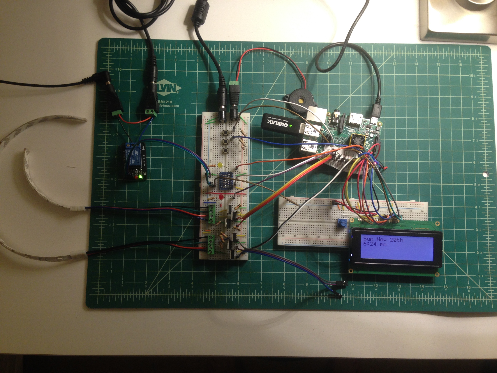
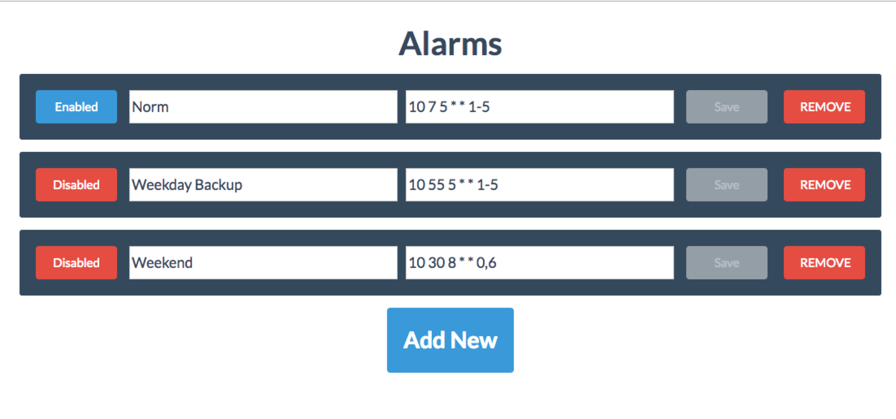

# PiAlarm
> Raspberry Pi-powered smart alarm clock. A RGB Light Strip, loud buzzer, bed shaker, web app, geo-location knowledge, and Character LCD display

# WIP

Action Items:

- Run on laptop for faster development (get rid of .is_pi() and use context.py with stub files)
- Refactor Python files for docstrings and variable case
- Fix:
    + Weather display doesn't update
    + Build better housing
- Make alarm creation easier (prevent loading bad cron syntax)
- Use raw React without Babel
- Add simply.js to modify alarms from watch: http://simplyjs.io/
- Configure router to use port 8000 from Raspberry Pi as port 80? (This way website doesn't need port in URL)
- Update README

## The Alarm

I'm a heavy sleeper, so I designed the alarm clock to go from pleasant to effective. When the alarm starts, a RGB LED strip lights up and gently increases in brightness. The second stage starts a buzzer and increase the LED strips brightness. The third stage initiates the bed shaker, buzzer, and fades the RGB LED strip between color values at full brightness. At any point, I can press the push button button and turn off the alarm.

<p align="center">
  
</p>
<p align="center">The prototype alarm</p>

## Display

The current display is a simple character LCD that I had lying around. I'm working on replacing it with a 4 custom RGB LED digits. I'm using shift registers to control the insane number of pins necessary to set each LED individually. I'll update the progress on the new display sometime soon.

## Location Smarts

Using If This Then That (IFTTT), I setup a recipe that makes a web request when I'm away to turn off the alarm and when I return to activate the alarm. This way, the alarm won't run unless I'm present.

## Web app

Using react and socket.io, I built a simple web app accessible anywhere. Once in the app, new alarms can be set using basic cron syntax. The back end of the app handles scheduling, starting, and deleting alarms as I modify the database of alarms.

<p align="center">
  
</p>
<p align="center">The web app</p>

## How to run your own version

First, check the pins.ini file in the Python/ directory, then proceed the test of each hardware before booting the web application for the first time.

### Initialization

You will need a secret.ini file in the Python/ directory:

```ini
[IFTTT]
key = <>

[WU]
info = Weather Underground API
apikey = <>
lat = <>
lon = <>
```

Python packages and other libraries installed, see the script `./Python/requirements.sh`

and Node modules: `cd PiAlarm; npm install`

There are likely other bugs, so open an issue if you run into any trouble. This app really isn't built for distribution and is only a personal side-project.

### Hardware Test: TM1637 7-Digit Display

```
cd PiAlarm/Python
python modules/TM1637.py
# There should be a few statements printed and you can press enter to confirm each test
```

## Acknowledgments

[Web app based on React example apps published by Twilio](https://www.twilio.com/blog/2015/08/setting-up-react-for-es6-with-webpack-and-babel-2.html)

## Made by

[Kyle King](http://kyleking.me)
