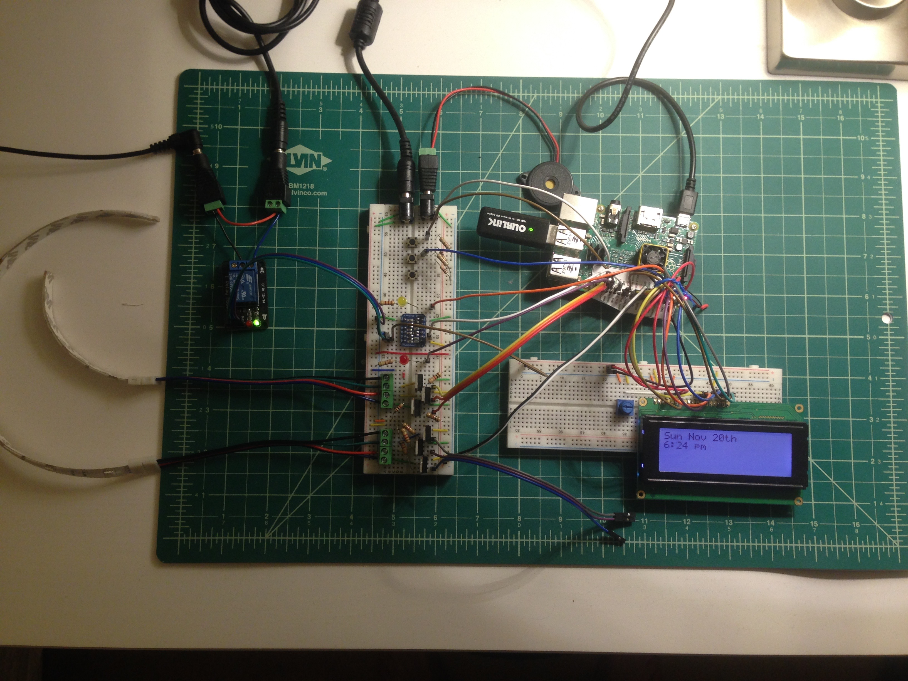

# PiAlarm

Raspberry Pi Smart Alarm Clock. RGB light strip, buzzer, character LCD display, and web app. Built with Plotly/Dash to handle the backend alarm clock control and the front-end user interactions

This has been a personal project that I was using for awhile. I originally hacked it together in Python2, but I've learned about TDD, architecture, and general code quality since then. I made an iteration building the entire alarm in NodeJS/React, but decided that Python is just a much better alternative and am using Plotly/Dash.

**Status:** the project was on ice for ~1 year, but I'm starting to work on it again in 2020. My goal is to have a MVP by April 30 and polish and complete the project by end of May. I'm working on other personal projects and have other activities that might interfere, but might as well set a goal!

## Tech

- Integrations
  - Plotly/Dash application to handle UI, basic HTML authentication, and managing a TInyDB instance
  - If This Then That (IFTTT)/generic HTML requests to toggle alarm on/off. Allows me to modify the alarm when not home and will automatically disable the alarm if I leave the general vicinity of my home until I return
- Electronics
  - RGB Light Strip
  - Buzzer
  - 7-Segment Display for time
  - Character LCD - shows weather and other quick information
  - (Used to also have a motorized bed shaker, but that got banned, haha)
- Box
  - Pretty janky, but easy to open and work on as a prototype. Will probably try to make something that looks nicer down the road

## Photos

<p align="center">
  
</p>
<p align="center">Initial Prototype</p>

<p align="center">
  
</p>
<p align="center">Prototype v2 with Box</p>

## Local Development

 

> FIXME: Update documentation for quick start. This is probably ~32% right

```sh
git clone https://github.com/KyleKing/pialarm.git
cd pialarm
poetry install
poetry shell
python pialarm.py
```

First, check the pins.ini file in the Python/ directory, then proceed the test of each hardware before booting the web application for the first time.

### Initialization

You will need a secret.ini file in the Python/ directory:

```ini
[IFTTT]
key = <>

[WU]
info = Weather Underground API
apikey = <>
lat = <>
lon = <>
```

Python packages and other libraries installed, see the script `./Python/requirements.sh`

There are likely other bugs, so open an issue if you run into any trouble. This app really isn't built for distribution and is only a personal side-project.

### Hardware Test: TM1637 7-Digit Display

```
cd PiAlarm/Python
python .archive-python/modules/TM1637.py
# There should be a few statements printed and you can press enter to confirm each test
```
